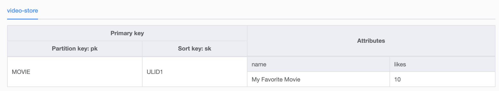

## Frontend tech

[Svelte](https://svelte.dev/) is modern solution for building user interfaces. It's a compiler that takes your declarative components and converts them into efficient JavaScript that surgically updates the DOM.

## Cloud provider overview

[AWS](https://aws.amazon.com/) is a cloud provider that offers a wide range of services. It's the provider i'm most comfortable working with and it's the one i've used the most.

## Infrastructure overview

[SST](https://sst.dev/) is a framework that makes it easy to deploy serverless applications. It's built on top of AWS CloudFormation and AWS Lambda.

For this fullstack app it worked well for integrating the Api with the frontend code.

## Computing overview

[Lambda](https://aws.amazon.com/pt/lambda/) simplifies devops by removing the need to manage servers. For this prototype it was a good fit because it's easy to setup and it's cheap to run.

## Database overview

Amazon [DynamoDB](https://aws.amazon.com/dynamodb/) is a fully managed NoSQL database service that provides fast and predictable performance with seamless scalability.

DynamoDB Pros in this context:

- Easy to setup and prototype
- No need to manage a database server
- Works well with AWS Lambda

DynamoDB Cons:

- No support for SQL
- No support for joins
- Changes in the schema require migration and refactors

